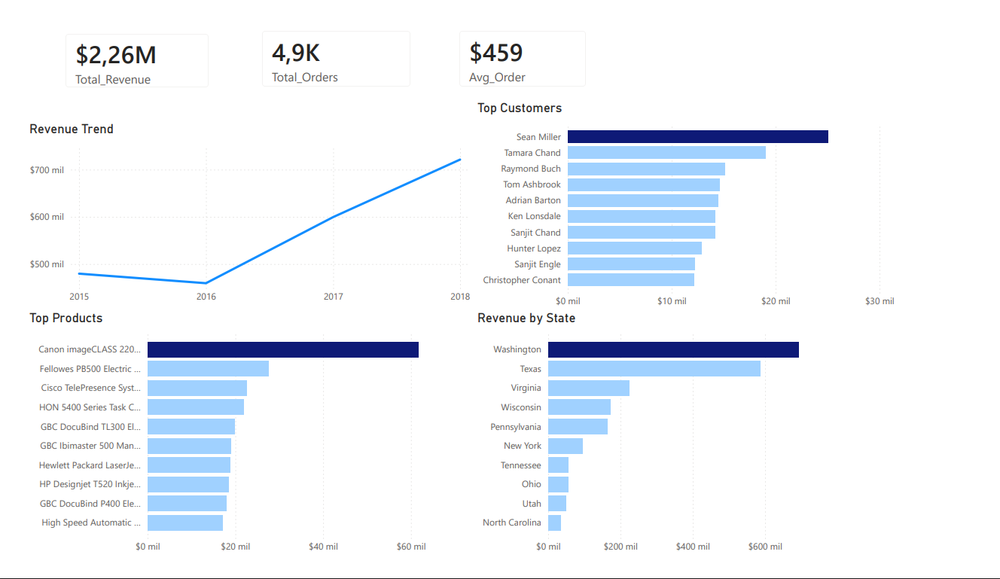

# 📊 Proyecto de Análisis de Datos de Ventas

## 📌 Descripción
Este proyecto presenta un flujo completo de análisis de datos (end-to-end), desde la limpieza de datos hasta la visualización en Power BI.

El objetivo es transformar datos crudos en información útil para la toma de decisiones.

---

## 🧠 Objetivo
- Limpiar y transformar datos
- Diseñar un modelo de datos eficiente (Star Schema)
- Analizar métricas clave del negocio
- Crear un dashboard profesional

---

## 🧱 Estructura del Proyecto

```
data-analytics-project/
├── 01_data_cleaning/
│   ├── cleaning.sql
│   └── README.md
│
├── 02_data_modeling/
│   ├── modeling.sql
│   └── README.md
│
├── 03_data_analysis/
│   ├── analysis.sql
│   └── README.md
│
├── 04_dashboard/
│   ├── sales_dashboard.pbix
│   ├── dashboard.png
│   └── README.md
```

---

## ⚙️ Tecnologías Utilizadas
- SQL Server
- T-SQL
- Power BI
- GitHub

---

## 🔹 1. Limpieza de Datos (01_data_cleaning)
- Eliminación de duplicados
- Conversión de fechas
- Limpieza de datos inconsistentes
- Manejo de valores nulos

---

## 🔹 2. Modelado de Datos (02_data_modeling)
- fact_sales
- dim_customer
- dim_product
- dim_date

---

## 🔹 3. Análisis de Datos (03_data_analysis)
- Ingresos totales
- Total de órdenes
- Ticket promedio
- Tendencias de ventas
- Top clientes y productos

---

## 🔹 4. Dashboard (04_dashboard)
- KPIs principales
- Tendencia de ingresos
- Top clientes
- Top productos
- Ingresos por estado

---

## 📊 Vista del Dashboard


---

## 🔍 Insights Principales
- Crecimiento de ingresos después de 2016
- Alta concentración de ventas en pocos clientes
- Productos líderes dominan ingresos
- Estados clave concentran ventas

---

## 👤 Autor
Julio Manchay
